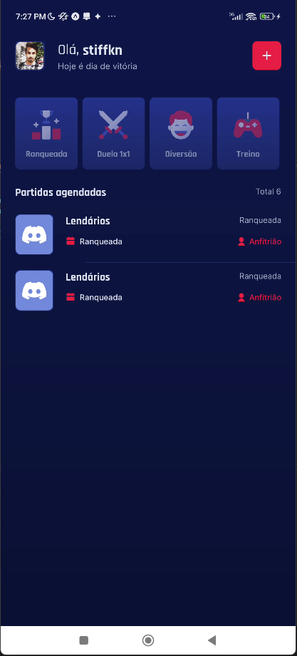
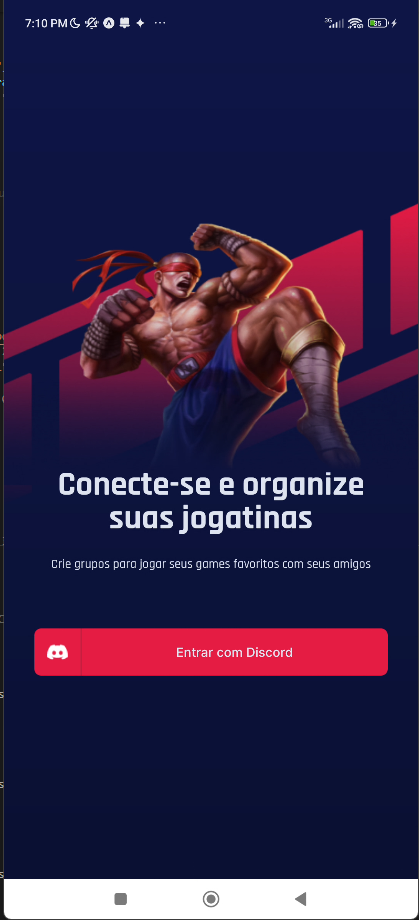
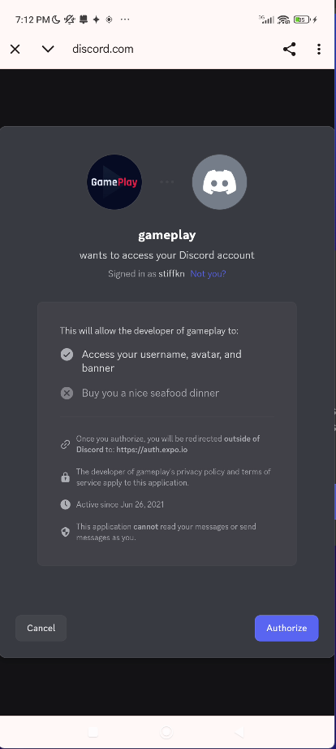
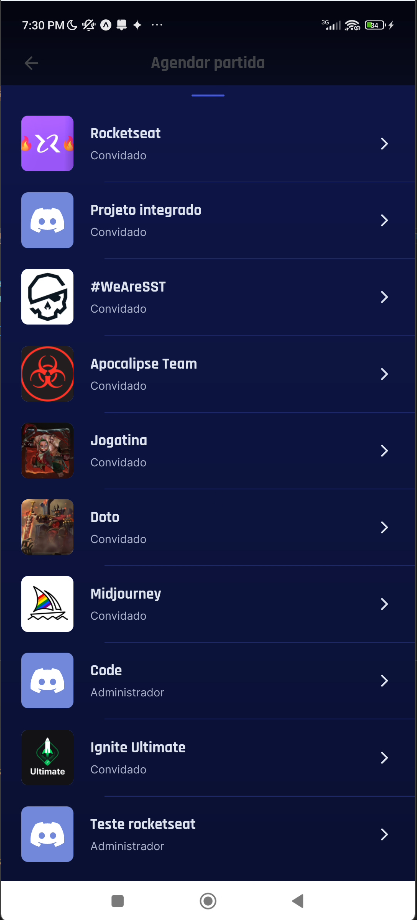
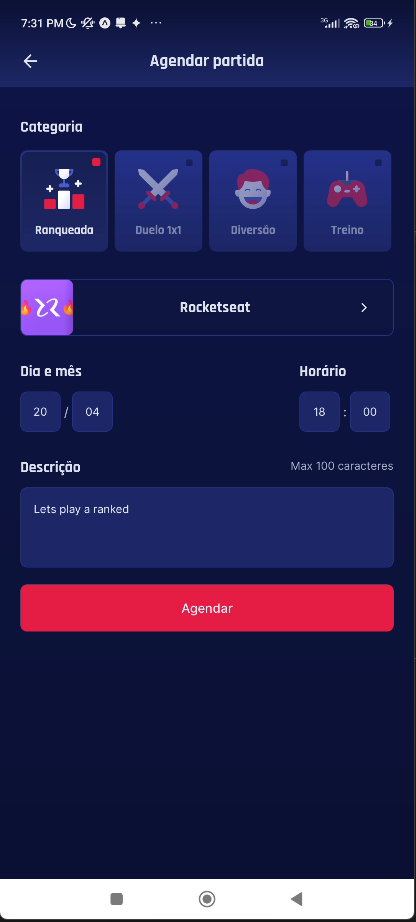
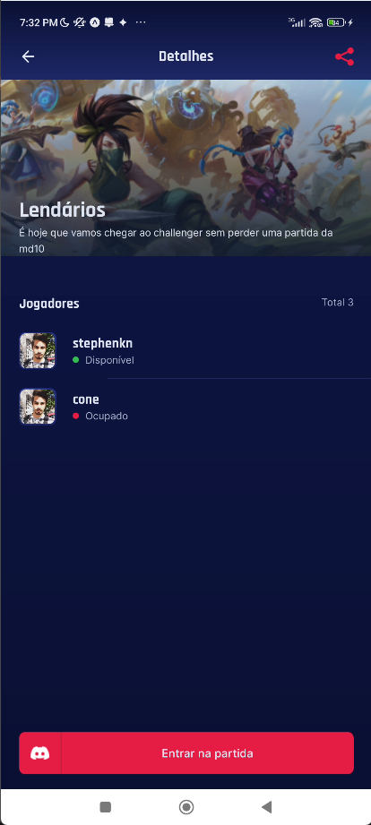

# GamePlay - Discord Game Scheduling App 🎮

<div align="center">
  <h1>🎮 GamePlay</h1>
  <p>Schedule your gaming sessions with friends using Discord integration</p>
</div>

## 📱 About

GamePlay is a modern mobile application designed to help gamers organize and schedule online gaming sessions with friends. Built with React Native and integrated with Discord, it provides a seamless experience for managing gaming appointments and coordinating with your gaming community.

## ✨ Features

- 🔐 **Discord Authentication**: Secure login using your Discord account
- 🎯 **Game Scheduling**: Easily create and manage gaming sessions
- 🎮 **Discord Server Integration**: Select from your Discord servers when scheduling games
- 👥 **Friend Management**: Connect and coordinate with your gaming friends
- 📅 **Calendar View**: Keep track of upcoming gaming sessions
- 🔔 **Notifications**: Stay updated about your gaming appointments

## 🖼️ Screenshots

### Home Screen
<div align="center">
  
</div>

### Login Screen
<div align="center">
  
</div>

### Discord Login
<div align="center">
  
</div>

### Discord Servers Selection
<div align="center">
  
</div>

### New Game Scheduling
<div align="center">
  
</div>

### Game Details
<div align="center">
  
</div>

## 🚀 Technologies

- React Native
- TypeScript
- Discord OAuth2
- React Navigation
- Async Storage
- Expo

## 🛠️ Getting Started

### Prerequisites

- Node.js
- npm or yarn
- Expo CLI
- Discord Developer Account (for OAuth2 integration)

### Installation

1. Clone the repository
```bash
git clone https://github.com/yourusername/gameplay-rocketseat.git
```

2. Install dependencies
```bash
cd gameplay-rocketseat
npm install
# or
yarn install
```

3. Configure environment variables
Create a `.env` file in the root directory and add your Discord OAuth2 credentials:
```
REDIRECT_URI=
SCOPE=
RESPONSE_TYPE=
CLIENT_ID=
CDN_IMAGE=
```

4. Start the development server
```bash
npm start
# or
yarn start
```

## 🤝 Contributing

Contributions are welcome! Feel free to open an issue or submit a pull request.

## 📝 License

This project is licensed under the MIT License - see the [LICENSE](LICENSE) file for details.

## 👨‍💻 Author

Your Name - [Your GitHub Profile](https://github.com/yourusername)

---

<div align="center">
  Made with ❤️ by [Your Name]
</div> 